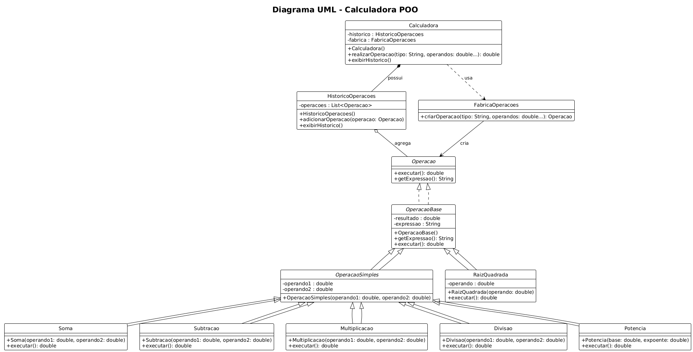

# Projeto Calculadora Java

Uma calculadora simples implementada em Java.

Descrição
-
Este repositório contém uma aplicação de calculadora escrita em Java. A interface pode ser em terminal ou GUI, dependendo da implementação presente no projeto. O objetivo deste README é explicar rapidamente como compilar e executar o projeto, além de mostrar a imagem ilustrativa da calculadora (arquivo PNG).
